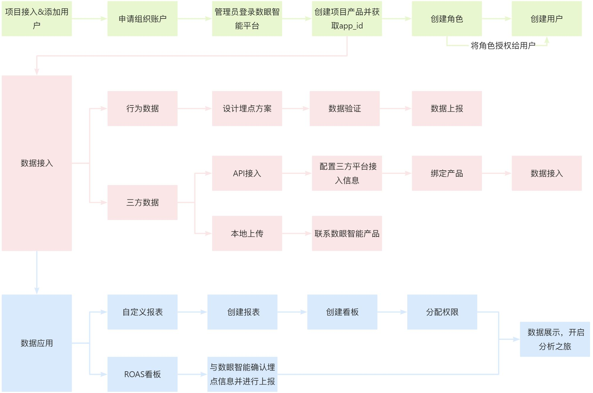
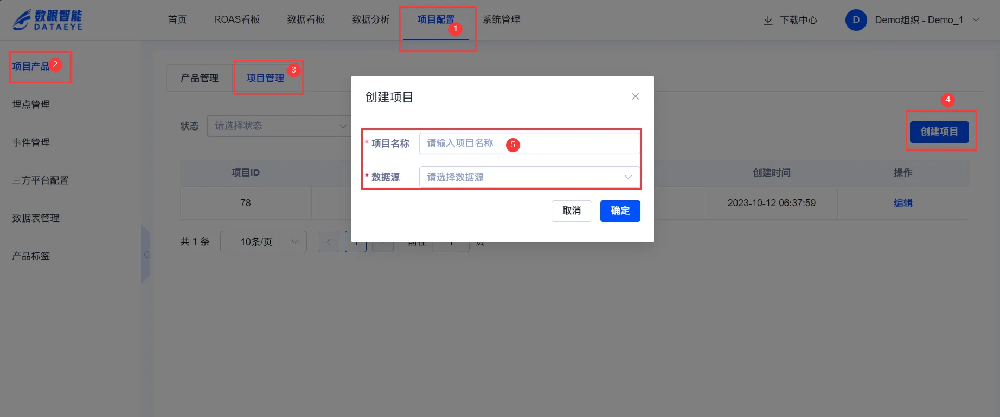

# 账号申请
您可以通过官网填写联系信息，我们会尽快与您联系。

> 数眼智能官网地址：[https://www.funsdata.com](https://www.funsdata.com/dataEye)

> 联系数眼智能客户经理开通组织权限，联系邮箱：[support@funsdata.com](mailto:support@funsdata.com)

# 操作流程
申请组织账户需要提供公司名称、管理员邮箱，平台会将登录地址以及初始密码发送至您的管理员邮箱。

# 项目产品接入
使用数眼智能前，您需要前往[项目产品](https://www.yuque.com/maticoo/eetpxb/hp4ms7m961op8rly)新建上报和分析所使用的项目和产品。

**新建项目**

项目配置——>项目产品——>项目管理——>新建项目——>配置项目名称和数据源——>保存

**新建产品**

项目配置——>项目产品——>产品管理——>新建产品——>配置产品信息——>保存

> 同一组织下产品包名不能重复。

# 数据接入
:::info
数据接入前请先了解[接入准备](https://www.yuque.com/maticoo/eetpxb/oyfw27lh9qgtsns3)工作。

:::

## 埋点数据接入
创建好产品拿到对应产品的app_id后，您就可以开始进行数据接入了。您可根据分析需求制定埋点方案，数眼智能提供的固定看板的埋点方案参考[买量监控](https://www.yuque.com/maticoo/eetpxb/zssiegwapyhpv1qy)了解。产品上线前您可前往[埋点管理](https://www.yuque.com/maticoo/eetpxb/bfoypgl07h59hlnt)的Debug模式进行数据验证，具体上报的埋点信息您可前往[事件管理](https://www.yuque.com/maticoo/eetpxb/ug99fqefng71dsgg)查看。

## 三方数据接入
数眼智能支持归因、投放、变现、聚合等三方平台数据接入，您可前往[三方平台配置](https://www.yuque.com/maticoo/eetpxb/ydwbttg0sgip9cx1)进行操作，三方平台信息配置完成后，您需要前往[项目产品](https://www.yuque.com/maticoo/eetpxb/hp4ms7m961op8rly)进行三方平台与产品的绑定，即可完成数据接入工作。

# 用户权限分配
完成以上操作，您可以给其他用户分配权限，先前往[角色](https://www.yuque.com/maticoo/eetpxb/dh6lwmc1b5kvywyx#LAfVH)分配项目、产品、功能、数据权限。在前往[用户](https://www.yuque.com/maticoo/eetpxb/dh6lwmc1b5kvywyx#O4BgF)给用户配置角色，该用户即可和您一起开启数据分析之旅。

**角色**

**用户**

