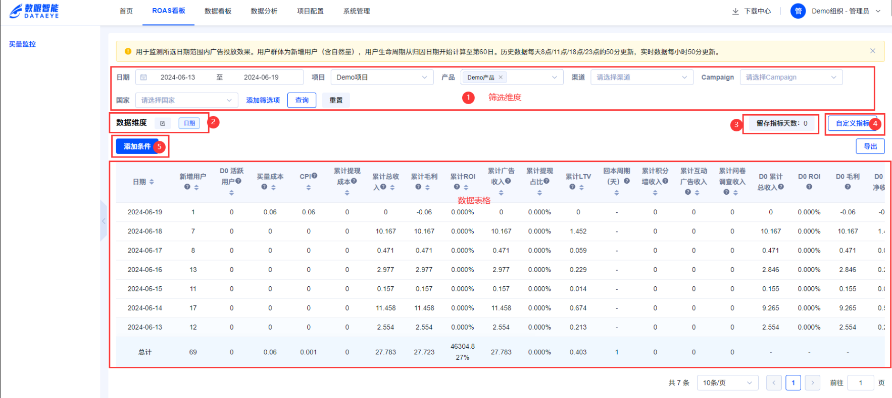

# 看板概述
以归因数据为基准结合成本、变现数据，分析所选日期范围内广告投放效果，帮助用户优化广告投放效果。用户群体为新增用户（含自然量），用户生命周期从归因日期开始计算至第60日。

# 功能介绍
1. 筛选维度：用于数据表格条件筛选，通过`添加筛选项`勾选更多您需要分析的维度，维度详情可查看[数据维度](#WfR74)
2. 数据维度：用于配置数据表格维度展示，维度详情可查看[数据维度](#WfR74)
3. 留存指标天数：用于配置数据表格中留存类指标留存字段展示
4. 自定义指标：用于配置数据表格中展示的指标，指标详情可查看[数据指标](#pGmeO)
5. 添加条件：对数据表格中展现的指标进行筛选过滤。

> 注意：选择添加条件后不支持汇总。
>

## 数据更新时间
历史数据每天8点/11点/14点/18点/23点的50分更新。

实时数据每小时50分更新。

## 时区&币种
以[项目产品](https://www.yuque.com/maticoo/eetpxb/hp4ms7m961op8rly)中的产品配置信息为准。

## 维度
> 涉及筛选条件和数据维度
>

| **维度** | **描述** |
| --- | --- |
| 产品 | 产品名称 |
| 渠道 | media_source，归因媒体渠道或restricted（受限渠道），organic为自然量 |
| Campaign | 广告系列名称 |
| 国家 | country_code，国家代码，如US、CN。英国的代码是UK而不是GB。 |
| Adset | 由一个或多个素材组成的广告组 |
| Adset ID | 广告组ID |
| Site ID | 子渠道ID |
| 广告样式 | ad_type，选择后仅展示广告变现指标 |
| APP版本 | app_version，归因用户的APP版本 |
| 生产商 | 通过归因平台device_model字段解析 |
| 机型 | 通过归因平台device_model字段解析。iPhone&iPad无此字段，统一在生产商查看。 |
| 操作系统 | platform，设备系统：ios，android |
| 操作系统版本 | os_version，设备的操作系统版本 |
| 收入来源 | 收入来源 |

## 数据指标
> 1. 留存指标按D0至D60展示每天的数据，需要结合留存指标天数使用。
> 2. 具体数据源信息在数据上报前需要与数眼智能确认。
> 3. DN代表留存天数，即D0（当天）、D1（次日）、D2（3日）等，留存数据根据留存天数，按天显示。
> 4. 累计数据为D0至DN的数据加总，DN数据为DN当天产生的数据。
> 5. 数据源为SDK上报的，event_name和properties需要根据SDK上报事件中提供的信息进行上报
>

| **指标类型** | **指标** | **指标说明** | **数据源** | **SDK上报事件** |
| --- | --- | --- | --- | --- |
| 基础指标 | 新增用户 | 统计周期内首次安装应用的去重用户数。 | 来自归因平台 | |
| 基础指标 | D0 活跃用户 | 统计周期内首次安装并当天启动应用的去重用户数 | 用户来自归因平台，结合SDK上报事件 | event_name='app_start' |
| 基础指标 | 买量成本 | 通过API向三方平台拉取的成本 | 来自三方平台 | |
| 基础指标 | CPI | 公式：买量成本/新增用户 | | |
| 基础指标 | 累计提现成本 | 新增用户生命周期内（60天）累计成功提现成本 | 来自SDK上报事件 | event_name='payermax_success' properties='amount' |
| 基础指标 | 累计总收入 | 新增用户生命周期内（60天）累计总收入 | | |
| 基础指标 | 累计毛利 | 公式：累计总收入-买量成本-累计提现成本 | | |
| 基础指标 | 累计ROI | 公式：累计总收入/(买量成本+累计提现成本)*100% | | |
| 基础指标 | 累计广告收入 | 通过API向三方平台拉取的累计收入 | 来自三方聚合平台，历史为真实数据，实时为预估数据 | |
| 基础指标 | 累计提现占比 | 公式：累计提现成本/累计总收入*100% | | |
| 基础指标 | 累计LTV | 公式：累计总收入/新增用户 | | |
| 基础指标 | 回本周期（天） | 新增用户生命周期内（60天）多长时间后开始回本，即生命周期内ROI首次>=100%的日期距新增用户发生日期相差的天数 | | |
| 基础指标 | 累计积分墙收入 | 新增用户生命周期内（60天）累计积分墙收入 | 来自SDK上报事件 | event_name='task_complete'，properties='off_payout' |
| 基础指标 | 累计互动广告收入 | 新增用户生命周期内（60天）累计互动广告收入 | 根据渠道不同数据分别来自三方平台和SDK上报事件 | 事件和属性需要与数眼智能确认 |
| 基础指标 | 累计问卷调查收入 | 新增用户生命周期内（60天）累计问卷调查收入 | 来自SDK上报事件 | event_name='offer'，properties in ('off_action','offer_type') |
| 留存指标_变现 | D0至D60累计总收入 | 新增用户生命周期内（60天）D0至D60的累计总收入 | | |
| 留存指标_变现 | D0至D60 ROI | 公式：DN 累计总收入/（买量成本+DN 累计提现成本） | | |
| 留存指标_变现 | D0至D60 毛利 | 公式：DN 累计总收入-买量成本-DN 累计提现成本 | | |
| 留存指标_变现 | D0至D60 人均净收益 | 公式：DN 毛利/新增用户 | | |
| 留存指标_变现 | D0至D60 LTV | 公式：DN 累计总收入/新增用户 | | |
| 留存指标_变现 | D1至D60 LTV增长系数 | 公式：DN LTV/LTV0 | | |
| 留存指标_变现 | D0至D60 ARPU | 公式：DN 总收入/DN 活跃用户 | | |
| 留存指标_变现 | D1至D60 ARPU增长系数 | 公式：DN ARPU/D0 ARPU | | |
| 留存指标_变现 | D0至D60 展现频次 | 公式：DN 展现次数/DN 活跃用户 | 广告展现，来自三方聚合平台，历史为真实数据，实时为预估数据 | |
| 留存指标_变现 | D0至D60 人均广告展现 | 公式：DN 展现次数/DN 看广告用户数 | 广告展现和看广告用户数，来自三方聚合平台，历史为真实数据，实时为预估数据 | |
| 留存指标_变现 | D0至D60 累计展现频次 | 公式：D0到DN的累计展现次数/新增用户 | 广告展现，来自三方聚合平台，历史为真实数据，实时为预估数据 | |
| 留存指标_变现 | D0至D60 展现频次_SDK | 公式：DN 展现次数_SDK/DN 活跃用户 | 来自SDK上报事件 | event_name='ad_imp' properties='ad_type' |
| 留存指标_变现 | D0至D60 eCPM | 公式：DN 总收入/DN 展现次数*1000 | | |
| 留存指标_变现 | D0至D60 广告渗透率 | 公式：DN看广告的用户/新增用户 | | |
| 留存指标_提现 | D0至D60 累计提现成本 | 新增用户生命周期内（60天）D0至D60的累计提现成本 | | |
| 留存指标_提现 | D0至D60 累计提现占比 | 公式：DN 累计提现成本/DN 累计总收入 | | |
| 留存指标_提现 | D0至D60 人均提现 | 公式：DN 提现成本/DN 活跃用户 | | |
| 留存指标_提现 | D0至D60 提现频次 | 公式：DN 提现次数/DN 活跃用户 | | |
| 留存指标_提现 | D0至D60 提现渗透率 | 公式：DN 提现人数/新增用户 | | |
| 留存指标_提现 | D0至D60 提现留存率 | 新增提现用户在DN天仍有提现行为的活跃用户占比，公式：DN 提现活跃用户/D0 提现用户 | | |
| 留存指标_行为 | D0至D60 留存率 | 新增用户在DN天仍有活跃的用户占比，公式：DN 活跃用户/新增用户 | 来自SDK上报事件 | event_name='app_start'或event_name='ta_app_start'或event_name='AppOpen' |
| 留存指标_行为 | D0至D60 人均使用时长 | 公式：DN用户使用时长/D0活跃用户 | 来自SDK上报事件，单位秒 | event_name='app_end'，properties='duration' |

## SDK上报字段
> 以下字段必须通过SDK上报才能在分析模型中应用
>

| 类型 | 事件名 | 显示名 | 属性名 | 描述 | 数据类型 | 对应指标 |
| --- | --- | --- | --- | --- | --- | --- |
| 事件 | app_start | app启动 | - | - | - | 活跃用户 |
| 事件 | payermax_success | 提现成功 | amount | 成本 | 数值 | 提现成本 |
| 事件 | task_complete | 积分墙收入 | off_payout | 收入 | 数值 | 积分墙收入 |
| 事件 | offer | 问卷调查 | off_action | 收入 | 数值 | 问卷调查收入 |
| 事件 | offer | 问卷调查 | offer_type | 类型 | 文本 | 问卷调查收入 |
| 事件 | ad_imp | 广告展示 | ad_type | 类型 | 文本 | 展现频次_SDK |
| 事件 | ad_imp | 广告展示 | placementid | 聚合平台广告位ID | 文本 | 用于拆分广告收入 |
| 事件 | ad_imp | 广告展示 | media_platform | 聚合平台来源：admob、max | 文本 | 用于拆分广告收入 |
| 事件 | app_end | app关闭 | duration | 时长 | 数值 | 人均使用时长 |
| 用户 | - | - | aggregated_ad | 聚合平台来源：admob、max 上报规则：user_set | 文本 | 用于拆分广告收入 |

## 保存个性化配置
### 功能概述
买量监控支持用户根据个人需求保存以下自定义配置（保留的配置仅限个人使用）：

1. 筛选项：项目/产品/渠道等15个过滤条件
2. 数据维度：按渠道/Campaign/国家等13中分组查看方式
3. 指标设置：展示的统计指标（如新增用户、CPI、ROI）、结果条件过滤、留存天数设置

### 操作说明
#### 新建配置

1. 设置筛选项：
    1. 默认可配置项目、产品、渠道、Campign、国家
    2. 日期不可设置默认每次打开为近7天
    3. 更多筛选项可通过“添加筛选项”进行添加
2. 调整数据维度：点击“添加维度”配置需要展示的内容
3. 指标设置：
    1. 指标设置：设置需要展示的指标
    2. 条件过滤：对表格中的指标结果进行二次过滤
    3. 当日留存：设置表格中留存数据需要展示的留存周期，例如选7日留存，会展示D0至D7日数据

4. 保存配置：

    1. 默认筛选仅支持另存为
    2. 点击“另存为”按钮，输入筛选条件名称后，保存当前配置
    3. 配置按组织隔离，同一用户下名称不可重复
    4. 系统默认展示最新保存的配置
    5. 最多可以保存50个自定义配置

#### 切换配置

1. 保存后，可通过右上角切换配置
2. 自定义配置支持“保存该筛选条件”和另存为
    1. 保存该筛选条件：更新当前配置
    2. 另存为：保存为新的配置

